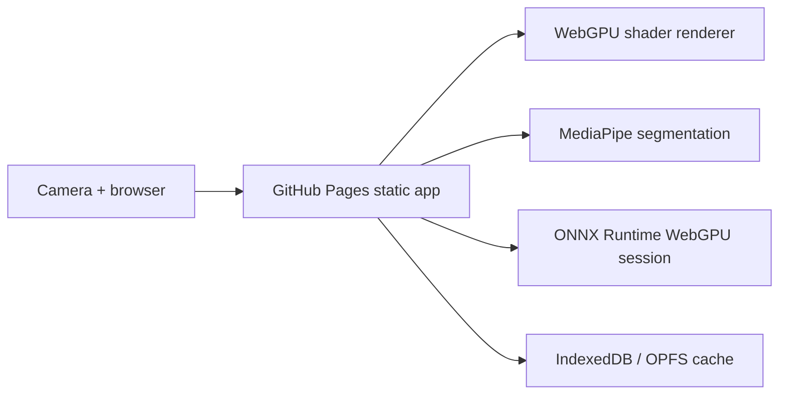

# Dreamcamera

[Live app](https://baditaflorin.github.io/dreamcamera/) | [Repository](https://github.com/baditaflorin/dreamcamera) | [Support](https://www.paypal.com/paypalme/florinbadita)

Real-time browser camera filters that transform live video into dreamlike AI-native visual memories.

Dreamcamera is a GitHub Pages app: camera frames stay on the device, visual processing runs in the browser, and AI/WASM modules are loaded only after the user starts the camera.

## Quickstart

```sh
npm install
make install-hooks
make dev
make build
make smoke
```

## Architecture



## Documentation

- Architecture: `https://github.com/baditaflorin/dreamcamera/blob/main/docs/architecture.md`
- ADRs: `https://github.com/baditaflorin/dreamcamera/tree/main/docs/adr`
- Deployment: `https://github.com/baditaflorin/dreamcamera/blob/main/docs/deploy.md`
- Privacy: `https://github.com/baditaflorin/dreamcamera/blob/main/docs/privacy.md`

