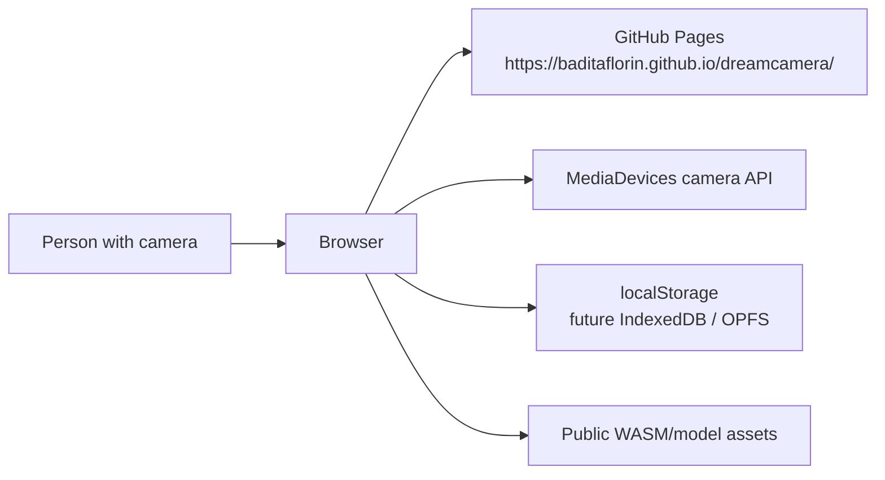
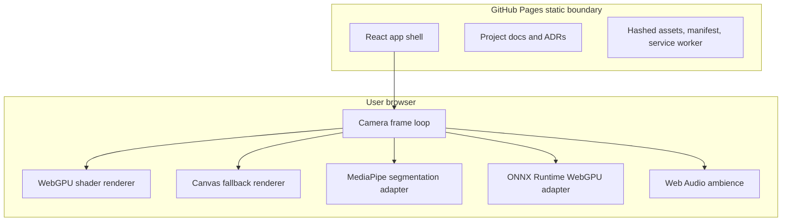

# Architecture

Dreamcamera is a Mode A GitHub Pages application. It has no runtime backend.

## Context

## Container

## Boundaries

- Camera frames are read from `navigator.mediaDevices.getUserMedia`.
- The main renderer prefers WebGPU and falls back to Canvas 2D.
- MediaPipe and ONNX Runtime Web are dynamically imported after user action.
- No server receives camera frames, generated frames, model inputs, or settings.
- GitHub Pages serves `docs/` from `main`.
